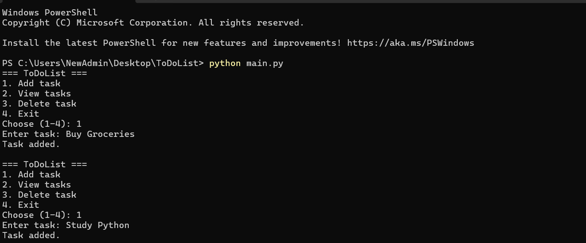

# ToDoList Project

A simple command-line ToDo List app in Python.

## What it does
- Add tasks
- View tasks
- Mark tasks as **completed**
- Delete tasks (optional), if you keep this feature)

## Screenshot

## Task status
Tasks now show their current status:

## Run
1. Open terminal in this folder.
2. Run:
